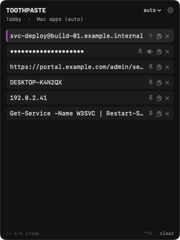
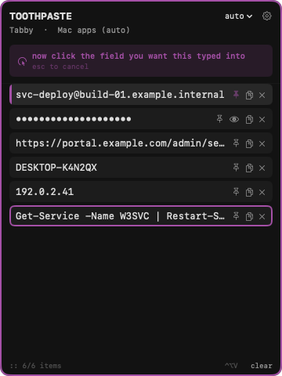
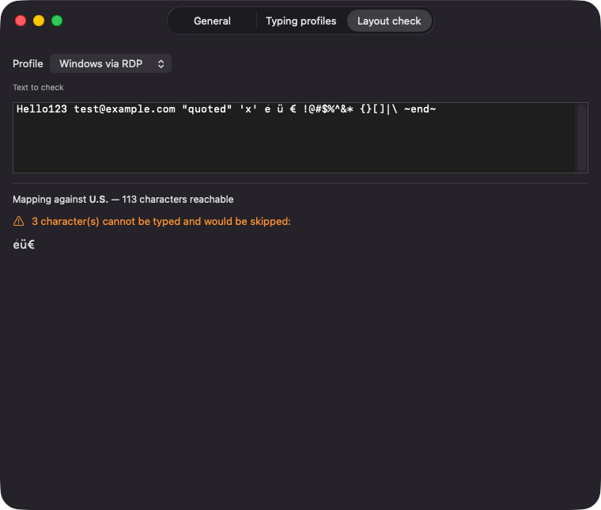

# Toothpaste

A macOS menu-bar clipboard history manager that pastes by **simulating keystrokes**
instead of ⌘V, so it works where the normal paste path is blocked: RDP sessions,
VM consoles, browser-based terminals, and password fields.

Inspired by [0xpaste](https://github.com/mypetcheetah/0xpaste) (Windows, Electron).
Native Swift, no third-party dependencies, ~2.4 MB.



## Install

Four commands. The whole thing takes a few minutes, most of it waiting for the
toolchain.

```sh
xcode-select --install     # Swift toolchain, if you don't have it yet
git clone https://github.com/erymantho/mac-toothpaste.git && cd mac-toothpaste
make cert                  # one-time: creates a local signing certificate
make install               # builds, installs to ~/Applications, launches it
```

Then grant **Accessibility** when the app asks. It explains why and links straight to
the right settings pane.

### Why the certificate step

macOS ties the Accessibility permission to the app's code signature. Without a stable
certificate, every rebuild produces a different signature and macOS revokes the
permission, so you would re-approve it after every single build. `make cert` creates a
self-signed certificate that lives only in your login keychain.

It will report `CSSMERR_TP_NOT_TRUSTED`. That is expected for a self-signed root and
does not stop anything. Note that `security find-identity -v` **hides** such
certificates, so use it without `-v` when looking for it.

Create it **once**. Two certificates with the same name make the build pick
whichever the keychain happens to list first, and that order is not stable, which
makes the permission reset at random. `make cert` refuses to create a second one.

### Why build rather than download

An app you download is quarantined, and Gatekeeper rejects anything that is not
notarised by Apple, which needs a paid developer account. An app you build locally is
not quarantined and simply runs. Building also means the signing certificate is
*yours*, so your permission does not depend on anyone else's certificate not expiring.

## Using it

Press **⌃⌥V**, or click 📝 in the menu bar.

1. **Pick an item.** The panel stays open and the item is *armed*.
2. **Click the field you want it in.** Any window will do, including one inside a
   remote session. That click is what chooses the destination.
3. It types. **Esc cancels** mid-stream, wherever focus is.



Picking an item does not send it. The panel stays open and waits, so the click that
follows is what decides where the text lands. That is the whole reason it works inside
a remote session, where the caret sits wherever you last clicked on the far side.

Start typing to search; Esc clears it. ↑/↓ move the selection, ⏎ arms it. Pin an item
to keep it. Drag the panel by its header; it reopens where you left it.

Right-click 📝 for the menu, or the gear in the panel for settings.

## History is a session thing

**Nothing you copy is written to disk.** Restart the app and the history is empty
except for what you pinned. Pinning is how you say "this one should stick around".
Items a password manager marks as secret show as dots and are never persisted, pinned
or not. Verified against 1Password and Bitwarden.

The `clear` button confirms itself: click once, it becomes *sure?*, click again. It
leaves pinned entries alone.

## Typing profiles

Local Mac apps and remote sessions need opposite settings, so the destination app
decides which profile applies. Two ship by default:

- **Mac apps**: the Mac's own layout, Option combinations allowed
- **Windows via RDP**: the US layout, no Option, no Unicode fallback, slower pacing.
  Claims Windows App, Devolutions RDM, Omnissa Horizon and VMware Fusion.

The panel header shows which profile is in force; the menu beside it overrides the
automatic choice.

**Layout check** in Settings is the one worth knowing about: pick a profile, paste any
text, and see exactly which characters that layout cannot produce, *before* typing a
password into a remote machine.



Over RDP an unproducible character is skipped and reported rather than guessed. Guessing
would type the letter `a`, because the Unicode fallback pairs its payload with virtual
key 0, which *is* the A key, and RDP clients read the key code rather than the
payload.

## Updating

Toothpaste checks for a new version at launch; when there is one, the menu bar icon gains
an arrow and Settings → Updates offers to install it. Pressing the button quits
Toothpaste, pulls and rebuilds from the checkout you installed from, and starts the new
version — about a minute, no terminal. It shows the release notes first, for every
version since yours and split into what is new and what was fixed, so you see what you
are getting before you take it. Afterwards a window says which version you came from and
what you got, or why the update did not finish.

(That is from 1.3.0 on. A copy on 1.2.x still shows only the newest version's notes, as
plain text, and opens no window afterwards — the update that brings it to 1.3.0 is still
run by its own older updater.)

Two things it says in the confirmation, and they are both true: unpinned history is never
written to disk, so it is gone after the restart, and the button **builds and runs
whatever is in the repository**. That is already what `git pull && make install` does —
the button just removes the terminal from in front of it. If you would rather keep that
step, switch off *Check for updates at launch* and do it by hand:

```sh
git pull
make install
```

Your certificate does not change, so the Accessibility permission survives either way.

Checking for updates is the only thing Toothpaste does over the network. It asks your own
clone's remote for its version tags; nothing about you or your clipboard is sent.

[CHANGELOG.md](CHANGELOG.md) says what each version changed. Settings → Updates shows
which one you are running, and the commit it was built from.

## Commands

```sh
make cert              # one-time: create the signing certificate
make install           # build, install to ~/Applications, run from there
make run               # alias for install
make verify            # regression-check capture and persistence
make appearances       # render every window in light and dark, to dist/appearances
make reset-permission  # clear a stuck Accessibility grant for this bundle id
make clean             # remove .build/ and dist/
```

Run the installed copy rather than `dist/Toothpaste.app`. The Accessibility grant
follows the code signature and applies to either, but launch-at-login registers a path
that `make app` deletes, and two registered copies show up twice in Launchpad.

If the app insists the permission is missing while System Settings shows it enabled,
the entry is stale: `make reset-permission`, then `make install` and grant once.

## How it was built

Written collaboratively with [Claude Code](https://claude.com/claude-code), over two
days, by someone who had not written Swift before. That is worth stating plainly rather
than leaving you to guess from the commit history.

It also explains [`PLAN.md`](PLAN.md), which is unusually detailed for a project this
size: a development log of what was decided and why, including the approaches that were
tried and failed. If you fork this and touch the typing engine, read section 3 first.
It will save you the day it cost here.

Everything in it was measured against real RDP sessions, real password managers and
real hardware. Where a conclusion turned out to be wrong, the correction is in the log
next to the original reasoning.

## Licence

[MIT](LICENSE). 0xpaste is MIT too. No code was taken from it, since this is a
from-scratch Swift implementation, but the licence choice follows it deliberately.

## What this is, plainly

It types your clipboard contents as synthetic keystrokes, and that works in password
fields too, because Secure Input Mode does not block it. That is the point of the tool,
and it also means it is functionally an autotyper. If you are putting it on a managed or
shared machine, that is worth raising with whoever looks after it.

One setting changes that description. *Drag an entry to a field to click and type there*
is off unless you switch it on, and with it on Toothpaste posts a mouse click of its own
at the point you release before it types — so it is an autoclicker as well. Left off, it
only ever posts keystrokes.

It can also update itself, which means it can fetch code and run it. That is inherent to
installing by building from source — you already trust the repository — but a button that
does it without a terminal is worth knowing about for the same conversation.
